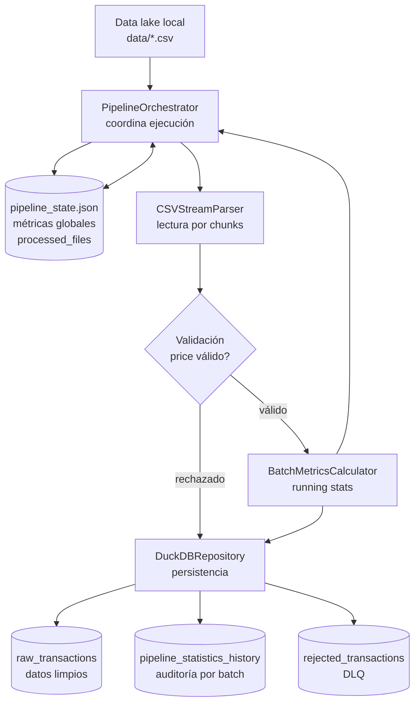
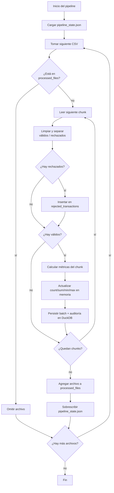
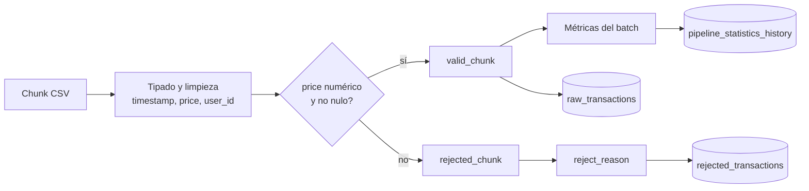
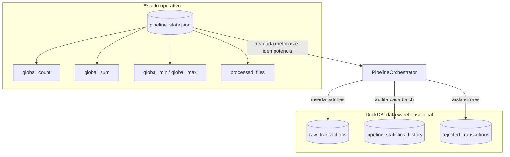

# Microbatch ETL Engine

Pipeline ETL en Python para procesar archivos CSV por micro-batches, limpiar registros, insertar datos válidos en DuckDB y mantener estadísticas continuas sin recalcular históricos con consultas `SELECT` sobre toda la base.

La versión actual agrega persistencia de estado en `pipeline_state.json`. Ese archivo permite pausar, reiniciar y procesar nuevos CSV que lleguen al directorio `data/`, conservando el acumulado histórico de `count`, `sum`, `min`, `max` y evitando reprocesar archivos ya cargados.

## Qué Resuelve

- Procesa CSVs grandes en chunks para mantener consumo de memoria O(1).
- Calcula estadísticas incrementales en Python con running stats.
- Persiste el estado global en `pipeline_state.json`.
- Usa `processed_files` para hacer el pipeline idempotente por nombre de archivo.
- Separa la carga inicial de archivos fuente de la comprobación con `validation.csv`.
- Inserta registros válidos en DuckDB y manda registros inválidos a una DLQ.
- Mantiene una tabla de auditoría por micro-batch para trazabilidad.
- Ejecuta consultas agregadas a DuckDB solo como reconciliación/demostración, no como fuente para reconstruir el histórico del pipeline.

El pipeline puede calcular métricas en memoria durante una ejecución, ademas de que puede continuar desde ejecuciones anteriores leyendo `pipeline_state.json` al iniciar.

Ejemplo de estado después de procesar datos válidos:

```json
{
  "global_count": 1250,
  "global_max": 999.95,
  "global_min": 1.25,
  "global_sum": 428750.5,
  "processed_files": [
    "batch-a.csv",
    "batch-b.csv",
    "batch-c.csv"
  ]
}
```

Campos:

- `global_count`: cantidad acumulada de registros válidos usados para las métricas.
- `global_sum`: suma acumulada de `price`.
- `global_min`: mínimo global histórico de `price`.
- `global_max`: máximo global histórico de `price`.
- `processed_files`: archivos completados correctamente; si un nombre aparece aquí, el orquestador lo omite en ejecuciones futuras.

El estado inicial en memoria usa `global_min = +inf` y `global_max = -inf`; una vez procesados registros válidos, esos valores quedan reemplazados por límites reales.

## Arquitectura

### 1. Vista General

Este diagrama muestra las responsabilidades principales. El JSON gobierna continuidad e idempotencia; DuckDB almacena datos y auditoría.



### 2. Ciclo de Procesamiento por Archivo

La idempotencia se valida antes de abrir cada CSV. El archivo se marca como procesado solo después de terminar todos sus chunks.



### 3. Ruta de Calidad de Datos

El parser no mezcla datos limpios con datos defectuosos. Cada chunk se bifurca antes de calcular métricas.



### 4. Mapa de Persistencia

El proyecto usa dos tipos de persistencia con propósitos distintos:



## Flujo de Datos en Palabras

1. `PipelineOrchestrator` carga `pipeline_state.json`.
2. Descubre los archivos fuente `*.csv` disponibles en `data_dir`, dejando `validation.csv` para la fase de comprobación.
3. Antes de procesar cada archivo, revisa si el nombre ya existe en `processed_files`.
4. `CSVStreamParser` lee el CSV por chunks y separa registros válidos/rechazados.
5. `BatchMetricsCalculator` calcula `count`, `sum`, `min`, `max` del chunk válido.
6. El orquestador fusiona esas métricas con el acumulado global en memoria.
7. `DuckDBRepository` inserta el batch válido y una fila de auditoría.
8. Al terminar el archivo completo, se actualiza `processed_files` y se guarda `pipeline_state.json`.

## Componentes Principales

| Componente | Archivo | Responsabilidad |
| --- | --- | --- |
| `PipelineOrchestrator` | `src/orchestrator.py` | Coordina ejecución, estado JSON, idempotencia, micro-batches y reconciliación. |
| `PipelineState` | `src/orchestrator.py` | Representa el estado persistente: métricas globales y archivos procesados. |
| `CSVStreamParser` | `src/csv_parser.py` | Lee CSVs por chunks, valida columnas y separa registros limpios/rechazados. |
| `BatchMetricsCalculator` | `src/stats_calculator.py` | Calcula métricas por batch y las acumula sin releer históricos. |
| `DuckDBRepository` | `src/db_repository.py` | Crea tablas, inserta raw data, auditoría y DLQ en DuckDB. |

## Esquema de Datos

DuckDB se usa como data warehouse embebido local:

- `raw_transactions`: registros válidos enriquecidos con `file_name`, `loaded_at` y `batch_id`.
- `pipeline_statistics_history`: snapshot de estadísticas después de cada micro-batch.
- `rejected_transactions`: registros rechazados por calidad de datos, junto con `reject_reason`.

`pipeline_state.json` no reemplaza esas tablas. Su rol es operativo: saber desde dónde continuar y qué archivos no deben repetirse.

## Instalación

Requisitos:

- Python 3.11 o superior.
- Git.

### Linux / macOS

```bash
python3 -m venv .venv
source .venv/bin/activate
pip install --upgrade pip
pip install -r requirements.txt
```

### Windows PowerShell

```powershell
python -m venv .venv
.\.venv\Scripts\Activate.ps1
python -m pip install --upgrade pip
python -m pip install -r requirements.txt
```

Si PowerShell bloquea la activación del entorno virtual:

```powershell
Set-ExecutionPolicy Unrestricted -Scope CurrentUser
```

## Ejecución

Ejecución estándar:

```bash
python -m src.orchestrator
```

La ejecución estándar procesa primero los archivos fuente (`*.csv` excepto
`validation.csv`) y luego ejecuta `validation.csv` como comprobación final, si
ese archivo existe en el directorio de datos.

Con tamaño de chunk personalizado:

```bash
python -m src.orchestrator --chunk-size 50000
```

Con rutas explícitas para datos, DuckDB y estado JSON:

```bash
python -m src.orchestrator \
  --data-dir data \
  --db-path data_warehouse.db \
  --state-path pipeline_state.json
```

En PowerShell, el mismo comando multilinea sería:

```powershell
python -m src.orchestrator `
  --data-dir data `
  --db-path data_warehouse.db `
  --state-path pipeline_state.json
```

## Cómo Continuar con Nuevos Archivos

Si ya procesaste dos archivos y luego agregas otros dos CSV al mismo directorio `data/`, el pipeline funciona como un data lake local:

- carga las métricas acumuladas desde JSON;
- omite los CSV que ya están en `processed_files`;
- descubre los `*.csv` fuente disponibles;
- procesa solo los archivos pendientes, sin importar el patrón del nombre;
- suma los nuevos registros al histórico;
- guarda nuevamente el JSON al terminar cada archivo.

Ejemplo:

```text
data/
├── batch-a.csv  # ya procesado
├── batch-b.csv  # ya procesado
├── batch-c.csv  # nuevo
└── batch-d.csv  # nuevo
```

En la siguiente ejecución, `batch-a.csv` y `batch-b.csv` se omiten; `batch-c.csv` y `batch-d.csv` se procesan y se agregan al estado.

## Validación del Reto

`validation.csv` se trata como un archivo de verificación, no como parte de la
carga inicial. El flujo estándar es:

- cargar los archivos base (`2012-1.csv` a `2012-5.csv`);
- imprimir las estadísticas incrementales y la reconciliación contra DuckDB;
- ejecutar `validation.csv` por el mismo pipeline;
- imprimir nuevamente las estadísticas y la consulta de reconciliación.

Si quieres hacer una prueba aislada sin mezclarla con el estado local principal,
usa rutas separadas:

```bash
python -m src.orchestrator \
  --data-dir data \
  --db-path validation_run.db \
  --state-path validation_state.json
```

Así validas sin contaminar el estado principal del pipeline.

## Evidencia de Ejecución

- DataGrip: inspección de `raw_transactions`, `pipeline_statistics_history` y `rejected_transactions`.
- Terminal: ejecución del pipeline mostrando la carga inicial, la validación y la reconciliación final.

Ubicación:

```text
docs/evidence/
├── datagrip-pipeline-statistics-history.png
├── datagrip-raw-transactions.png
├── datagrip-rejected-transactions.png
└── terminal-doble-ejecucion-y-tests.txt
```

## Cómo Reiniciar Desde Cero

Para reiniciar completamente el entorno local, elimina juntos los artefactos generados:

```bash
rm -f pipeline_state.json data_warehouse.db
```

En PowerShell:

```powershell
Remove-Item pipeline_state.json, data_warehouse.db -ErrorAction SilentlyContinue
```

Es importante reiniciar ambos artefactos al mismo tiempo. Si borras solo DuckDB pero conservas `pipeline_state.json`, el pipeline creerá que los archivos ya fueron procesados.

## Pruebas

Ejecutar toda la suite:

```bash
pytest
```

Ejecutar solo pruebas de métricas:

```bash
pytest tests/test_stats.py
```

Ejecutar solo pruebas de integración:

```bash
pytest tests/test_integration.py
```

La suite cubre:

- acumulación incremental de métricas;
- persistencia en DuckDB;
- separación de registros rechazados;
- escritura de `pipeline_state.json`;
- omisión de archivos repetidos;
- reanudación con un nuevo archivo sobre el histórico previo.

## Reconciliación

La lógica productiva del estado no recalcula históricos con `SELECT COUNT`, `SELECT SUM`, `SELECT MIN` o `SELECT MAX`. Esas métricas viven en memoria durante el procesamiento y se persisten en `pipeline_state.json` al finalizar cada archivo.

El método de reconciliación consulta DuckDB al final para demostrar que lo acumulado por running stats coincide con lo insertado en `raw_transactions`. Esa consulta es una validación, no el mecanismo usado para continuar el pipeline.

## Estructura del Proyecto

```text
.
├── data/
│   ├── 2012-1.csv
│   ├── 2012-2.csv
│   ├── 2012-3.csv
│   ├── 2012-4.csv
│   ├── 2012-5.csv
│   └── validation.csv
├── docs/
│   └── evidence/
├── src/
│   ├── csv_parser.py
│   ├── db_repository.py
│   ├── orchestrator.py
│   └── stats_calculator.py
├── tests/
│   ├── test_integration.py
│   └── test_stats.py
├── requirements.txt
├── pyproject.toml
└── README.md
```

Archivos generados en ejecución local:

- `pipeline_state.json`
- `data_warehouse.db`
- archivos auxiliares de DuckDB como `*.wal`, si aplica.
